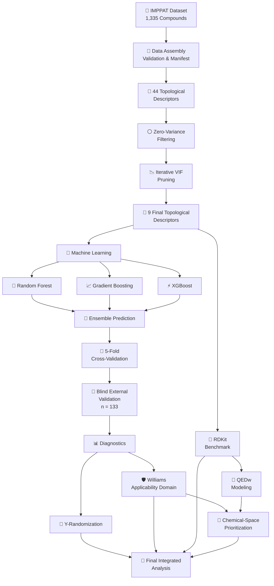
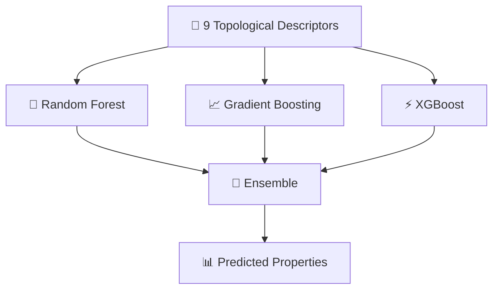
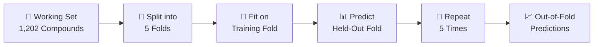
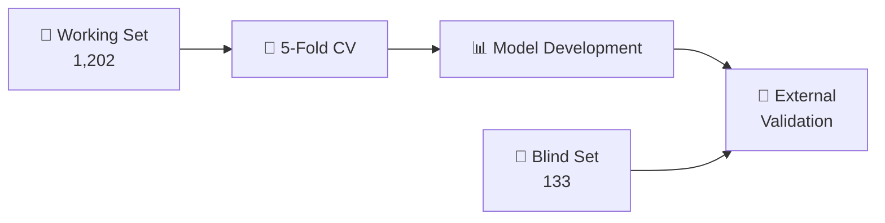
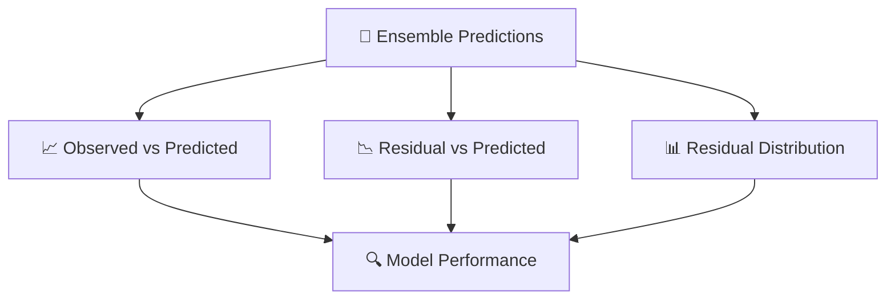
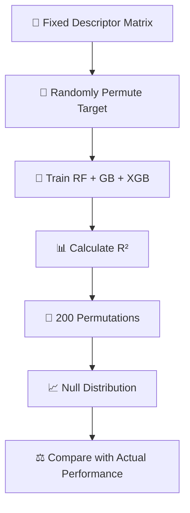
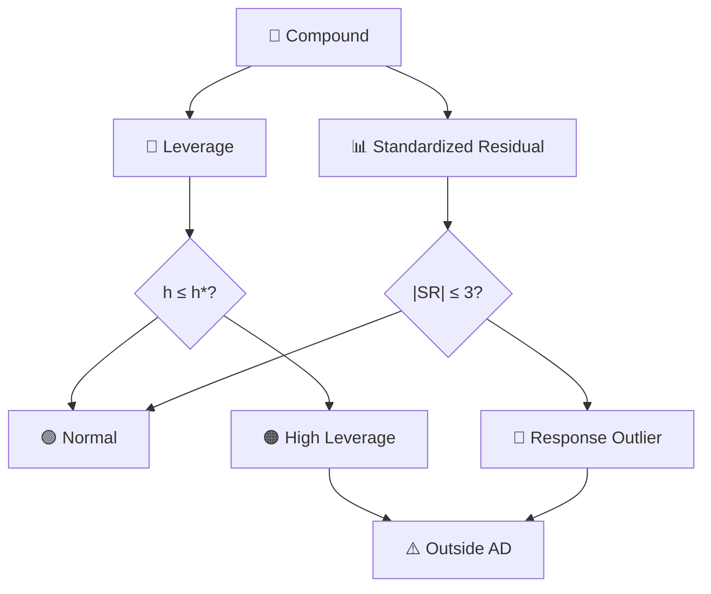
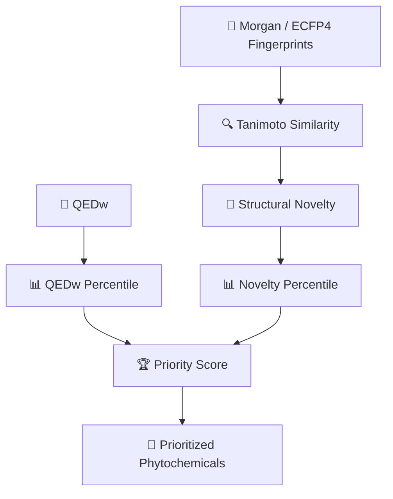

# 🧬 IMPPAT Topological Descriptor-Based QSPR Modeling

<p align="center">

### Machine Learning–Based QSPR Analysis of IMPPAT Phytochemicals

A reproducible computational pipeline for molecular descriptor reduction, ensemble QSPR modeling, blind validation, applicability-domain analysis, and phytochemical prioritization.


</p>

---

## 🔬 Overview

This repository contains the Python implementation of a **Quantitative Structure–Property Relationship (QSPR)** pipeline developed using the **IMPPAT phytochemical dataset**.

The project investigates whether a compact set of molecular topological descriptors can be used with machine-learning models to predict important physicochemical properties and **weighted Quantitative Estimate of Drug-likeness (QEDw)**.

The overall workflow combines:

**Descriptor reduction → Machine learning → Cross-validation → Blind validation → Statistical validation → Applicability domain → Chemical prioritization**

---

## 🧪 Dataset

The workflow uses **1,335 IMPPAT phytochemical compounds** divided into a working set and an independent blind set.

| Dataset                 | Compounds |
| ----------------------- | --------: |
| 🧬 Total dataset        | **1,335** |
| 🔵 Working set          | **1,202** |
| 🔴 Blind validation set |   **133** |

The data-assembly stage merges the physicochemical-property and topological-index sources into a validated modeling table and maintains reproducibility information for downstream analysis.

`Monoisotopic_Mass` is deliberately excluded from the modeling matrix because of its near-deterministic relationship with Molecular Weight, reducing the risk of direct target leakage.

---

# 🔄 Complete Research Pipeline



---

# 📉 Descriptor Reduction

The initial topological descriptor panel contains **44 descriptors**.

Descriptor reduction is performed using:


The descriptor QC procedure first removes zero-variance descriptors and then performs iterative VIF-based reduction. VIF calculations use standardized descriptor values to improve numerical stability.

## 🧬 Final Topological Descriptor Panel

|  # | Descriptor               |
| -: | ------------------------ |
|  1 | `Narumi_Katayama_index`  |
|  2 | `Multiplicative_Zagreb1` |
|  3 | `Mostar_index`           |
|  4 | `Szeged_index`           |
|  5 | `Spectral_radius`        |
|  6 | `Average_eccentricity`   |
|  7 | `Sigma_index`            |
|  8 | `Balaban_J_index`        |
|  9 | `Multiplicative_Zagreb2` |

These nine descriptors constitute the final panel used by the main ensemble modeling workflow.

---

# 🤖 Machine Learning Framework

Three regression algorithms are evaluated:



### Models

| Model                    | Description                         |
| ------------------------ | ----------------------------------- |
| 🌲 **Random Forest**     | Tree-based ensemble regression      |
| 📈 **Gradient Boosting** | Sequential boosting regression      |
| ⚡ **XGBoost**            | Gradient-boosted tree model         |
| 🤝 **Ensemble**          | Average prediction of RF + GB + XGB |

The primary workflow uses **300 estimators** and **five-fold cross-validation**.

---

# 🎯 Predicted Properties

The primary QSPR workflow models eight physicochemical properties:

| Property                 |
| ------------------------ |
| ⚛️ Molecular Weight      |
| 💧 Polar Area (TPSA)     |
| 🧩 Complexity (BertzCT)  |
| 🧪 XLogP (Crippen)       |
| 🔗 Heavy-Atom Count      |
| 🧲 H-Bond Donor Count    |
| 🧲 H-Bond Acceptor Count |
| 🔄 Rotatable-Bond Count  |

The QEDw endpoint is subsequently modeled using the same final nine-descriptor topological panel.

---

# 🔄 Leakage-Free Cross-Validation

The main modeling workflow uses **five-fold cross-validation**.



The descriptor panel is fixed using the predefined VIF criterion, while model fitting and scaling are performed within the appropriate training folds to avoid leakage from validation data.

---

# 🎯 Blind External Validation

A separate **133-compound blind set** is used for external validation.



Blind-set performance is evaluated using model predictions rather than selecting models solely from cross-validation performance.

---

# 📊 Model Diagnostics

The diagnostic stage evaluates observed versus predicted values and residual behavior.



The diagnostic workflow generates compound-level observed/predicted values and residual statistics for both cross-validation and blind validation.

---

# 🎲 Y-Randomization

Y-randomization tests whether predictive performance could arise from chance correlations.



The implementation performs **200 permutations** using a fixed **80/20 train/holdout split** and **30 estimators** for the permutation models. This is explicitly documented as a computational simplification compared with the main five-fold CV protocol.

---

# 🛡️ Applicability Domain

The Williams-plot analysis evaluates prediction reliability using:

* **Leverage**
* **Standardized residuals**
* **Applicability-domain boundaries**



Compounds are classified as normal, high leverage, response outliers, or outside the applicability domain according to leverage and standardized-residual thresholds.

---

# 🧪 RDKit Benchmark

An independent RDKit descriptor representation is generated for comparison with the topological descriptor approach.


Descriptors directly equivalent to the eight target properties are excluded from the RDKit candidate pool to maintain a fair benchmark.

The RDKit workflow follows the same general ensemble modeling structure as the topological model.

---

# 💊 QEDw Modeling

QEDw is treated as a **composite drug-likeness endpoint**.

The workflow uses:

```text
🧬 9 Topological Descriptors
            ↓
     🤖 RF + GB + XGB
            ↓
       🔄 5-Fold CV
            ↓
       🎯 Blind Validation
            ↓
       🎲 Y-Randomization
            ↓
       🛡️ Applicability Domain
```

The QEDw analysis uses the same 1,202/133 working/blind split and final nine-descriptor topological panel.

---

# 🧠 Phytochemical Prioritization

The final prioritization stage combines **drug-likeness** and **chemical-space novelty**.



Structural novelty is calculated using **ECFP4/Morgan fingerprints** and Tanimoto similarity to the five nearest neighbors within the 1,335-compound dataset.

### 🏆 Priority Score

```text
Priority Score =
0.5 × QEDw percentile rank
+
0.5 × Tanimoto novelty percentile rank
```

This provides a combined ranking based on drug-likeness and chemical-space novelty.

---

# 📁 Repository Structure

```text
📦 topological-descriptor-ml
│
├── 📄 README.md
│
├── 🐍 step1_data_assembly.py
├── 🐍 step3_4_pipeline.py
├── 🐍 step9_10_11_modeling.py
├── 🐍 step12_13_diagnostics.py
├── 🐍 step14_yrandomization.py
├── 🐍 step15_williams_ad.py
│
├── 🧪 step16a_rdkit_descriptors.py
├── 📉 step16b_rdkit_vif.py
├── 🤖 step16c_rdkit_models.py
│
├── 🏆 step17_best_model.py
├── 💊 step18_qedw_modelling.py
├── 🧠 step19_prioritization_v2.py
├── 📊 step20_final_integration.py
│
├── 🎲 yrand_one_property.py
├── 📊 yrand_aggregate.py
└── 📈 bootstrap_blind_r2_full.py
```

---

# 🐍 Requirements

The pipeline uses the following major Python packages:

```text
numpy
pandas
scikit-learn
scipy
statsmodels
matplotlib
openpyxl
xgboost
rdkit
```

Install the commonly used packages with:

```bash
pip install numpy pandas scikit-learn scipy statsmodels matplotlib openpyxl xgboost
```

For RDKit, use an appropriate RDKit-compatible Python/Conda environment.

---

# ▶️ Running the Pipeline

The scripts are organized according to the research workflow and should generally be executed sequentially.

### 1️⃣ Data Assembly

```bash
python step1_data_assembly.py
```

### 2️⃣ Descriptor QC and VIF Reduction

```bash
python step3_4_pipeline.py
```

### 3️⃣ QSPR Modeling

```bash
python step9_10_11_modeling.py
```

### 4️⃣ Diagnostics

```bash
python step12_13_diagnostics.py
```

### 5️⃣ Y-Randomization

```bash
python step14_yrandomization.py
```

### 6️⃣ Applicability Domain

```bash
python step15_williams_ad.py
```

### 7️⃣ RDKit Benchmark

```bash
python step16a_rdkit_descriptors.py
python step16b_rdkit_vif.py
python step16c_rdkit_models.py
```

### 8️⃣ Model Selection

```bash
python step17_best_model.py
```

### 9️⃣ QEDw Modeling

```bash
python step18_qedw_modelling.py
```

### 🔟 Compound Prioritization

```bash
python step19_prioritization_v2.py
```

### 1️⃣1️⃣ Final Integration

```bash
python step20_final_integration.py
```

---

# 🔁 Reproducibility

The primary workflow uses:

| Parameter                          | Setting              |
| ---------------------------------- | -------------------- |
| 🧬 Total compounds                 | **1,335**            |
| 🔵 Working set                     | **1,202**            |
| 🔴 Blind set                       | **133**              |
| 🔢 Initial topological descriptors | **44**               |
| 🧬 Final topological descriptors   | **9**                |
| 🔄 Cross-validation                | **5-fold**           |
| 🤖 Main model estimators           | **300**              |
| 🎲 Y-randomization                 | **200 permutations** |
| 🌱 Random seed                     | **42**               |

The data-assembly stage records the random seed, column roles, file hashes, dataset shape, and validation checks to support reproducible downstream processing.

---

# ⚠️ Important Note

This repository contains the **Python source code** for the analysis pipeline.

The following are intentionally not included in this code-only repository unless distribution is permitted:

* Raw datasets
* Excel input files
* Generated Excel workbooks
* Generated figures
* Intermediate model outputs
* Checkpoint files

Several scripts currently reference predefined local input/output directories. When running the code on another system, update the corresponding file paths.

---

# 📌 Research Summary

This project implements a reproducible QSPR framework for IMPPAT phytochemicals by combining a compact topological descriptor representation with ensemble machine learning.

The workflow emphasizes:

**🔢 Descriptor reduction**
**🤖 Ensemble machine learning**
**🔄 Leakage-controlled cross-validation**
**🎯 Blind external validation**
**🎲 Y-randomization**
**🛡️ Applicability-domain assessment**
**🧪 RDKit benchmarking**
**💊 QEDw modeling**
**🧠 Chemical-space prioritization**

---

## 🛠️ Technologies

<p align="center">

**Python** • **RDKit** • **Scikit-learn** • **XGBoost** • **Pandas** • **NumPy** • **SciPy** • **Statsmodels** • **Matplotlib**

</p>

---

## 👨‍💻 Project

### IMPPAT Phytochemical QSPR Analysis

**Molecular Structure → Descriptor Reduction → Machine Learning → Reliable Prediction → Phytochemical Prioritization**

<p align="center">

⭐ **If this repository is useful for your research, consider starring the repository.**

</p>
